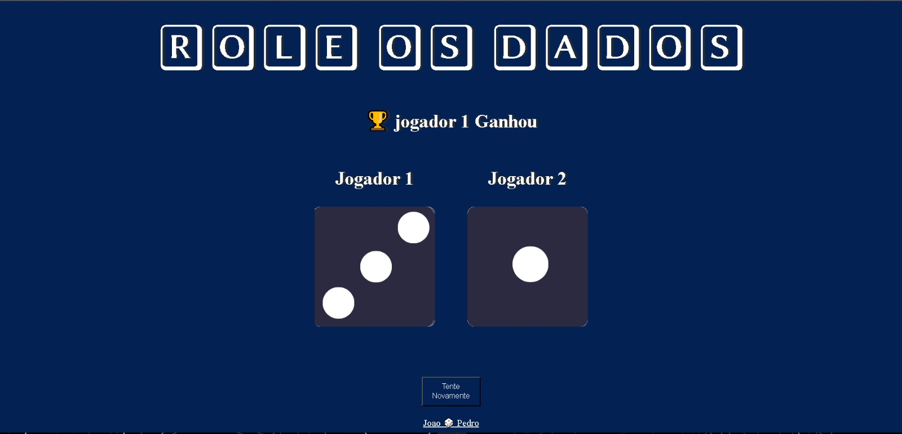

# RollDice

Mini‑jogo simples de rolar dados feito com HTML, CSS e JavaScript.

##  Sobre
Esse projeto implementa um minigame que simula o lançamento de um dado de seis faces. Clique em um botão para gerar um número aleatório entre 1 e 6, exibido na tela com estilo visual.

##  Tecnologias utilizadas
- **HTML**: estrutura da página e elementos visuais (botão, display do dado).
- **CSS**: estilos simples e responsivos para layout e efeitos visuais.
- **JavaScript**: lógica do jogo (gerar número aleatório, atualizar interface).

##  Demonstração
> _Adicione aqui uma captura de tela (print) do jogo em funcionamento._
>
> 

##  Como rodar localmente
1. Clone este repositório:
   ```bash
   git clone https://github.com/Jotap‑stack/RollDice.git

